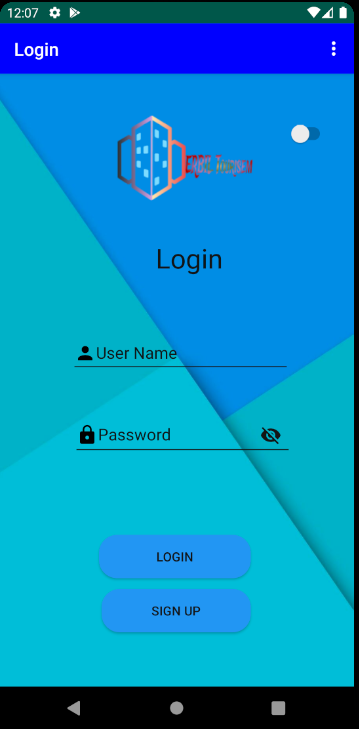
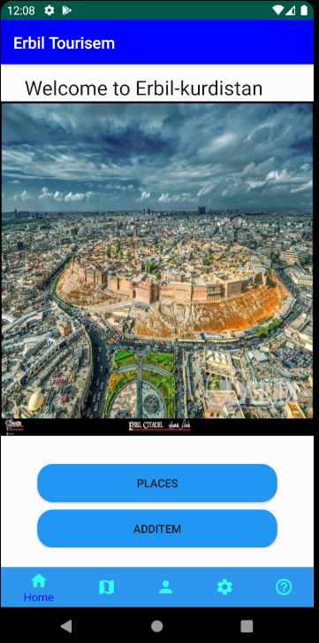
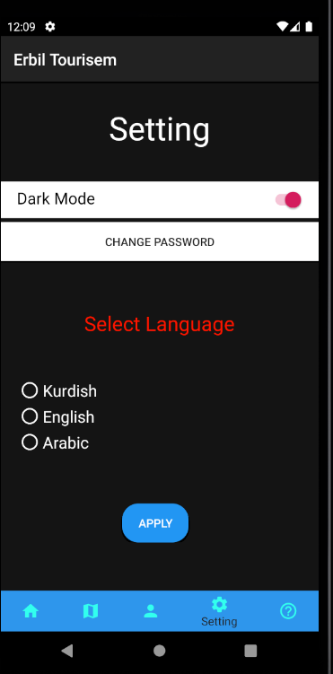
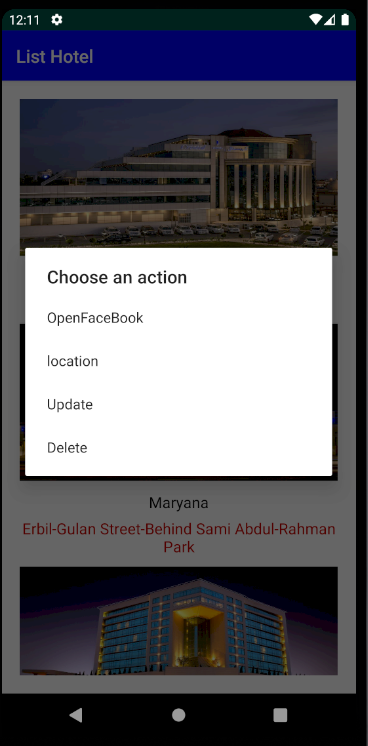

# Erbil-Tourism-Android

this application is very helful for this come out of kurdistan
to find place tourisms , Hotels, Resturants and malls or shops

this app have three diffrent languages kurdish, english, arabic.
 
in this application you can login and have a local database 
by using sqlite

and you can add places and modifi places and you can find location
by clicking the places 

               Login Page

              Main Page

              dark mode style

        Setting Language

         Modefie Place or find location or facebook

